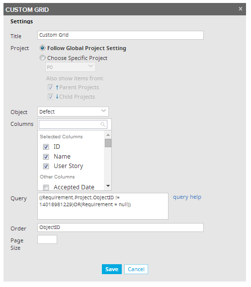
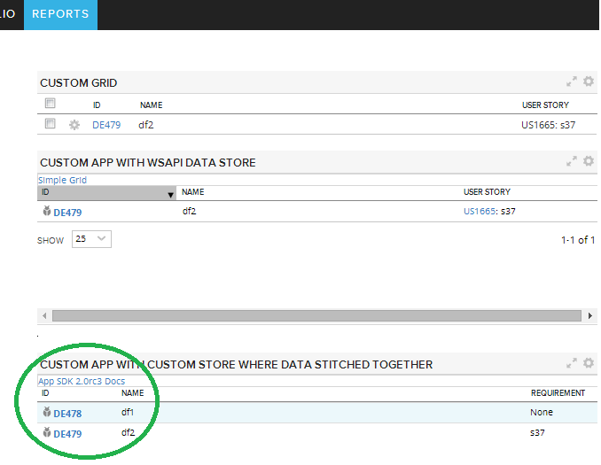

Stitching Data Together in a Custom Store
=========================

## Overview

PROBLEM:

1.Create two defects in a project, DE1 and DE2

2. DE1 has no association to a UserStory.

3. Associate DE2 with a story outside of the current project

4. Create a custom grid, choose Defect for object, and use this query:
(Requirement = null)
DE1 is returned as expected.

5. Remove the query from step 4 and use this query instead:
(Requirement.Project.ObjectID != 14018981229)
DE2 is returned as expected.

6. Combine the queries with OR:
((Requirement.Project.ObjectID != 14018981229)OR(Requirement = null))
Result: only DE2 is returned.
Expected result: both DE1 and DE2 are returned.

A CUSTOM APP WITH WSAPI STORE IS ALSO AFFECTED:

Using this filter in the code is equivalent to the query in the custom grid  and produces the same result

 var filters = Ext.create('Rally.data.QueryFilter', {
            property: 'Requirement.Project.ObjectID',
            operator: '!=',
            value: currentProject
        });
        filters = filters.or({
            property: 'Requirement',
            operator: '=',
            value: null  
        });
        filters.toString();
        
See wsapiStore/App.js

A CUSTOM APP WITH CUSTOM STORE THAT STITCHES RESULTS TOGETHER WORKS:

In this example a grid is based on Rally.data.custom.Store. Two separate wsapi stores are created with respective filters.
Resutls are pushed into array, which produces a multi-dimentional array and then the array is flattened to be used for custom store's 'data' config property.

## License
This app is vailable AS IS. It is NOT supported by Rally.

AppTemplate is released under the MIT license.  See the file [LICENSE](./LICENSE) for the full text.

##Documentation for SDK

You can find the documentation on our help [site.](https://help.rallydev.com/apps/2.0rc3/doc/)
